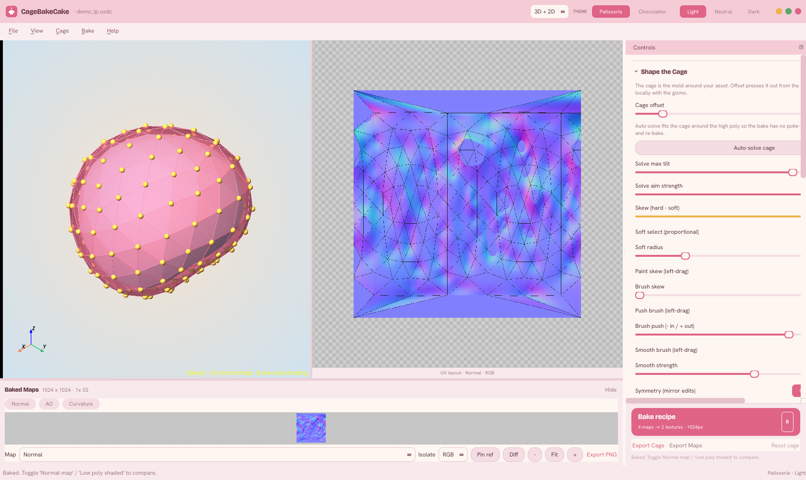
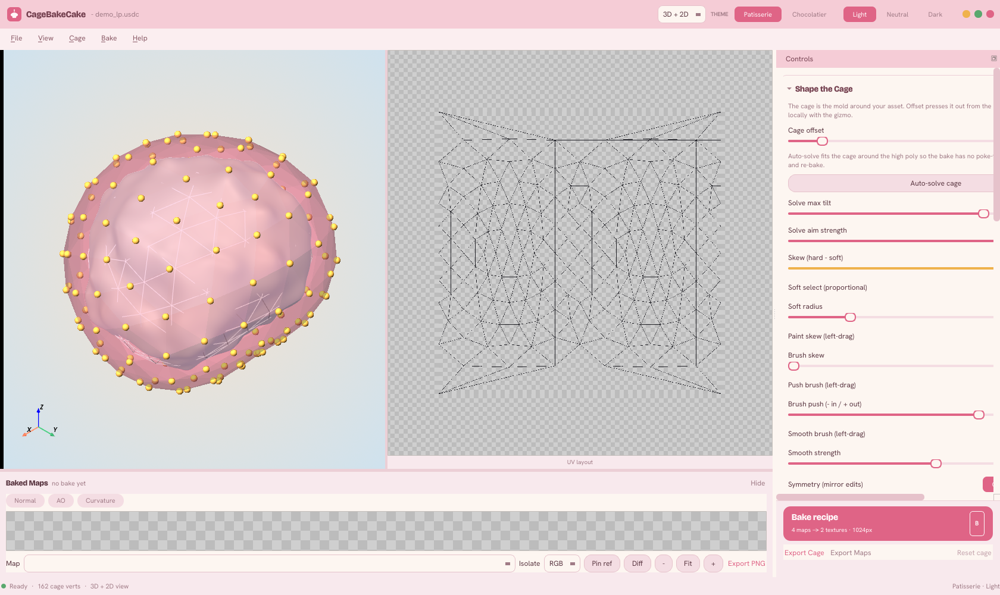
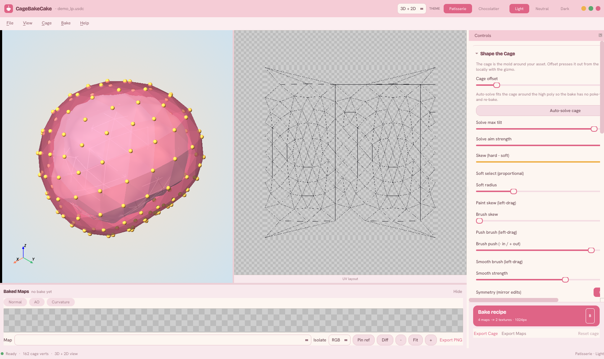
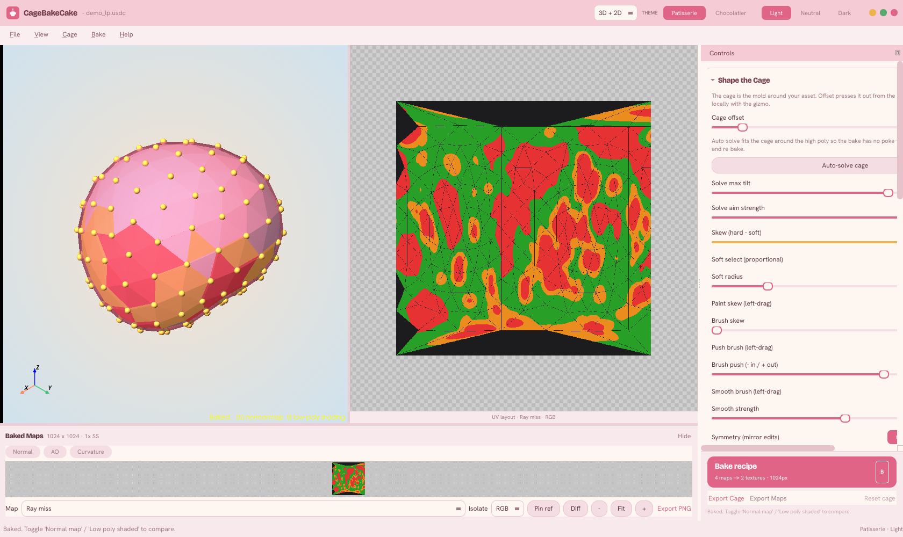
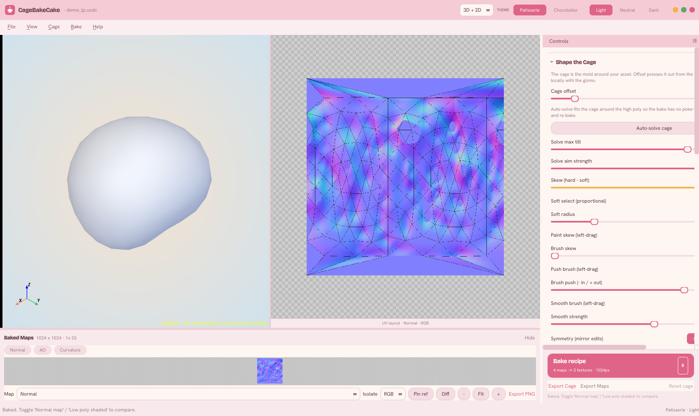
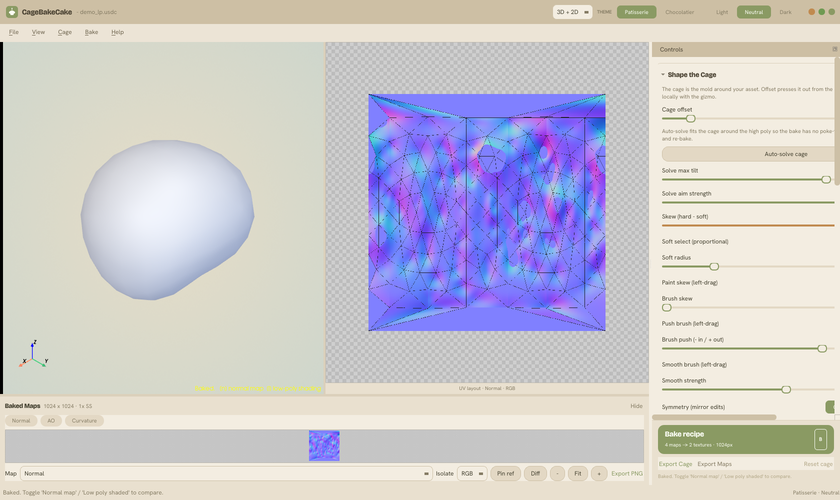
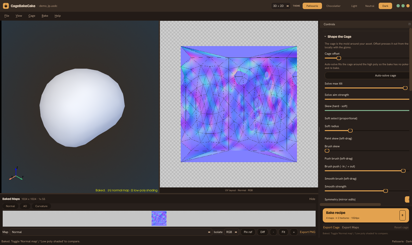
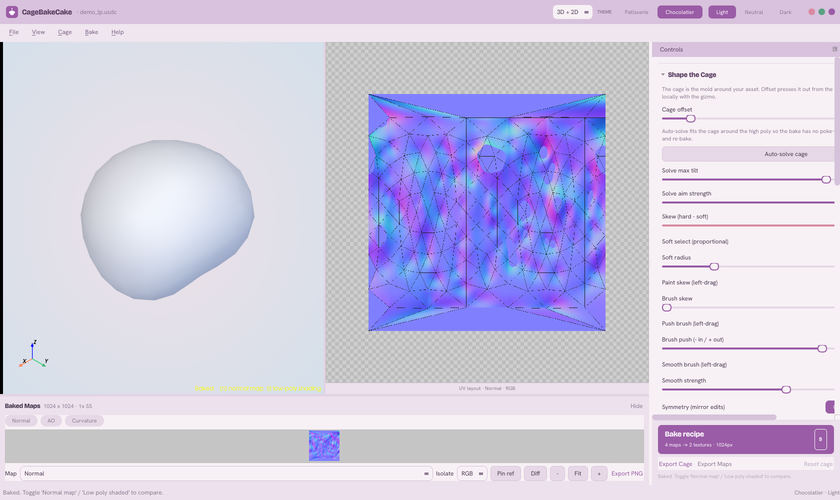
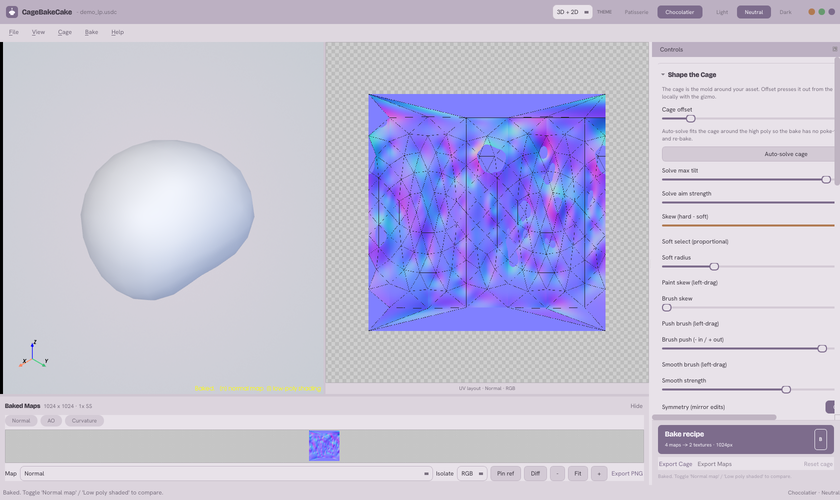
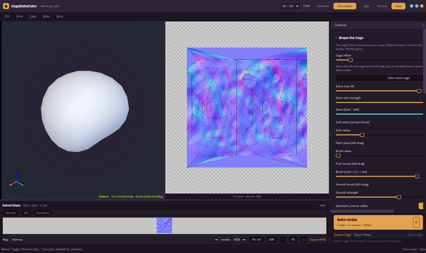

# Cage Bake Cake

A free, standalone editor for **bake cages** - the envelope around your low poly
that decides what a normal-map bake captures. Load a low poly and a high poly,
shape the cage, see problems before you bake, then bake and pack your maps.

No DCC required, no license fees, no accounts. Free and open source (MIT) -
in these crazy times artists deserve more free stuff.



## What is a bake cage?

When you bake a normal map, rays are fired from your low poly towards the high
poly. The cage is an inflated copy of the low poly that tells those rays where
to start and how far to search. Too tight and the high poly pokes through
(missed detail); too loose and rays hit the wrong surface (skewed, smeared
bakes). Most tools hide the cage or bury it inside one specific DCC - this app
makes it the thing you actually see and edit.

## How to use it

**Get it:** grab the Windows zip from the [Download](#download-windows-alpha)
section below - unzip, double-click, no installs. Then:

**1. Open your meshes.** `File > Open Low Poly...` and `File > Open High Poly...`,
or just drag the files into the window. The app reads USD (`.usd` / `.usda` /
`.usdc`), which every major DCC can export. Have only FBX or OBJ? A converter
script using Blender ships in `tools/blender_to_usd.py`.

**2. Inflate the cage.** The `Cage offset` slider in *Shape the Cage* pushes the
whole cage out along the low poly's normals until it swallows the high poly.



**3. See through it.** Turn `Cage opacity` down or up until you can read the
high poly through the envelope while you work.



**4. Let the app show you the problem spots.** Bake once (`Bake > Bake normal
map`), then flip on the **ray-miss overlay**: orange marks places where the high
poly pokes out of the cage (too tight), red marks rays that found nothing nearby
(too loose). Both in the 3D view and painted over your UV layout - so you catch
over- and under-projection *before* you commit to a final bake.



**5. Fix spots by hand.** Click a cage vertex and slide it along its normal with
the gizmo. Soft select (proportional falloff), push and smooth brushes, painted
skew, and mirror-edit symmetry are all in the *Shape the Cage* dock.

**6. Bake and pack your maps, your way.** The **Bake recipe** card is the main
event: start from a preset (`Game-ready`, `Hero asset`, `AO + Curvature`), add
whatever maps you wish - tangent or object normals, AO, curvature, cavity,
height, position, thickness - and pack any of them into the R/G/B/A channels of
your output PNGs, exactly to your liking. One press of `B` bakes the whole
recipe. Recipes are saved with your project, so a setup you like is reusable on
the next asset.



**7. Save your work.** `File > Save Project As...` writes a `.cbcproj` with your
cage edits, bake settings, and recipe. Export the cage itself as USD for use in
any other baker (`File > Save Cage As...`), or export the baked maps directly
(`Export Maps`).

## Themes

Two flavours (Patisserie, Chocolatier), three moods (Light, Neutral, Dark) -
pick your vibe from the top bar.

| | Light | Neutral | Dark |
| --- | --- | --- | --- |
| **Patisserie** |  |  |  |
| **Chocolatier** |  |  |  |

## Download (Windows, alpha)

Prebuilt Windows binaries are attached to [GitHub Releases](../../releases):
download `CageBakeCake-windows-x64.zip`, unzip anywhere, run `CageBakeCake.exe`
(no Python needed). The build is unsigned, so SmartScreen will warn on first
launch - click "More info" then "Run anyway". If it fails to start, run
`CageBakeCake-console.exe` from the same folder and report the error it prints.

This is a rough alpha: expect sharp edges, and please report anything odd via
GitHub issues.

## For developers

Full disclosure: this whole app is an **LLM vibe-coding experiment** - designed,
written, and documented end-to-end with an AI pair. It works (there is a real
test suite and the bakes are honest), but read the code with that in mind and
expect alpha-quality corners. If any of it is useful to you - the cage math, the
headless bake pipeline, the USD I/O - take it, it's MIT. Hope it's a useful
starting point.

Run from source:

```
python -m pip install -r requirements.txt
python -m cagebakecake your_lowpoly.usdc --high your_highpoly.usdc
```

Useful flags: `--cage cage.usdc`, `--hdr env.hdr`, `--push <world units>`,
`--no-qt` (bare pyvista window), `--screenshot out.png` (headless render).
There is also a window-less CLI for CI/batch use: `--bake` bakes a low/high
pair straight to PNGs, and `--bake-project shot.cbcproj` bakes a saved
project's recipe.

Tests: `python -m pytest`. Windows binaries are built by
`.github/workflows/release.yml` whenever a `v*` tag is pushed (PyInstaller
one-folder bundle, zipped onto a GitHub Release).

Documentation lives in `docs/`:

- `docs/architecture.md` - tech stack and module layout.
- `docs/cage-model.md` - the cage data model and displacement math.
- `docs/interaction.md` - the viewport, sliders, gizmo, shader, and HDR controls.
- `docs/baking.md` - the normal-map bake algorithm.
- `docs/roadmap.md` - milestones, dependencies, and stretch goals.
- `docs/environment.md` - Python interpreter, venv, package versions, FBX status.

## License

MIT. Copyright (c) 2026 Wim Van Brussel / RightUpNorth. See [LICENSE](LICENSE).
