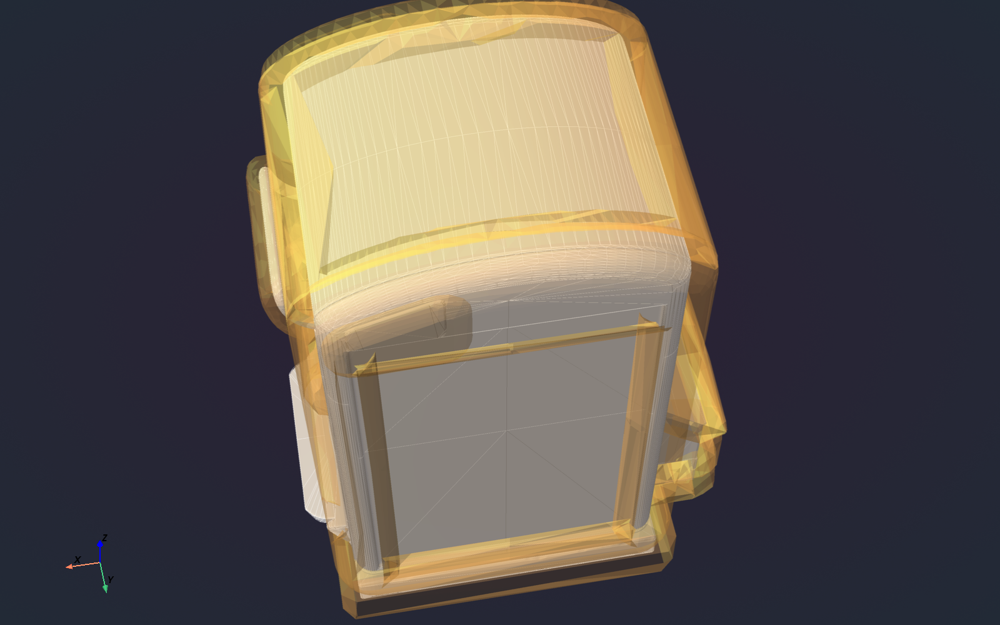
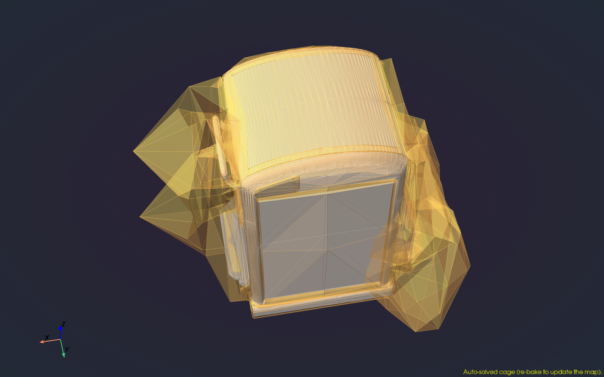
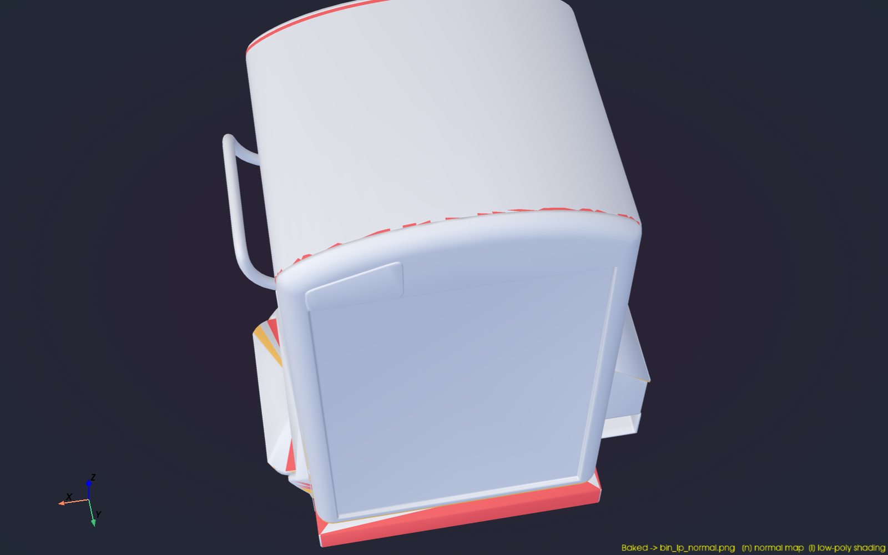
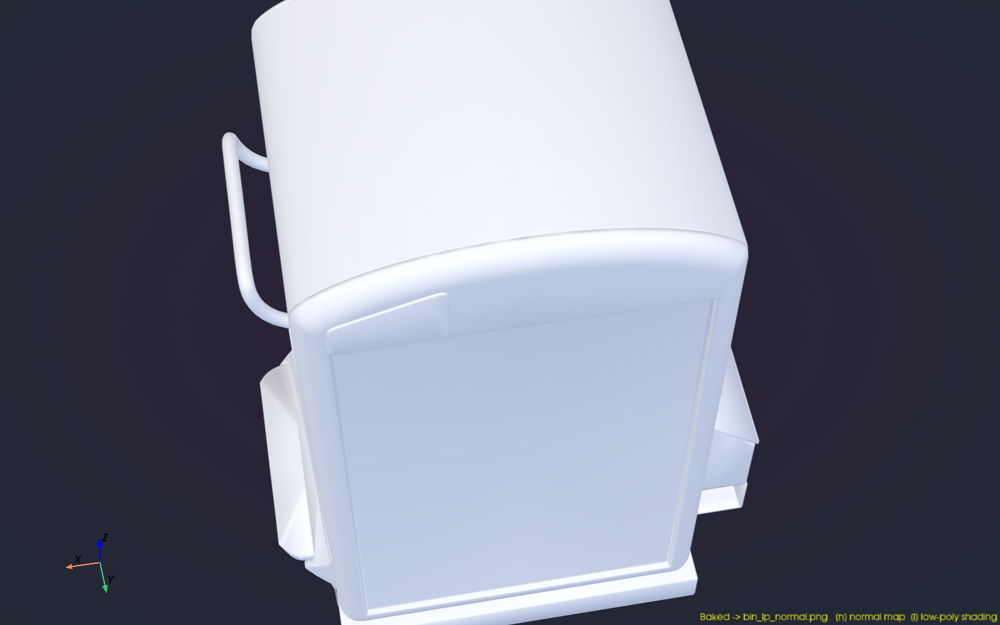

# Cage Bake Cake

An interactive, standalone Python tool for authoring and editing **bake cages** -
the offset envelope used to project high-poly detail onto a low-poly mesh when
baking normal maps.

| Rest cage over the high poly | Auto-solved cage |
| --- | --- |
|  |  |

## Why

Bake cages have to be re-authored every time a high-poly or low-poly asset
iterates. Existing tooling is locked inside a specific DCC (for example, Dynamite
for Houdini). The goal here is a small, scriptable, DCC-independent app that loads
the three meshes that matter - **low poly**, **cage**, **high poly** - and lets an
artist tune the cage and bake directly, with minimal dependencies.

## What it does

1. Loads a low-poly, a cage, and a high-poly mesh together (OBJ and FBX).
2. Pushes the whole cage outward along normals with a float slider.
3. Sets cage transparency with a slider so the high poly shows through.
4. Picks individual cage vertices and nudges them with a gizmo oriented to the
   low-poly vertex normal, to fix poke-through or over-projection locally.
5. Shades the high poly with a simple PBR material lit by an HDR environment, with
   shift-drag to rotate the HDR ("move the light" by spinning the environment).
6. Bakes a tangent-space normal map from high to low poly, bounded by the cage.
7. Auto-solves the cage: fits a per-vertex offset that encloses the high poly
   (no poke-through) and aims the firing direction into overhangs, as a starting
   point the artist refines by hand.

## Screenshots

| Ray-miss feedback (too-tight cage) | Baked normal map |
| --- | --- |
|  |  |

The overlay paints the low poly where the bake rays miss - orange where the high
poly pokes out beyond the cage (too tight), red where nothing was found nearby
(too loose) - so over/under-projection is visible before committing a bake.
Renders are produced headlessly by `tools/make_screenshots.py`.

## Status

Implemented. Roadmap milestones M1-M8 are complete (load, displacement/transparency
sliders, vertex gizmo, PBR + HDR, the cage-bounded normal-map bake, and soft-normal /
skew firing), plus the stretch goals (Qt front end, supersampling, UV-island padding,
AO + curvature maps, arbitrary non-topology-matched cages, and an auto-solver that
fits the cage to the high poly). See `docs/roadmap.md` and `docs/stretch-goals.md`.

## Quickstart

Install the dependencies into a virtualenv, then launch the Qt window:

```
python -m pip install -r requirements.txt
python -m cagebakecake assets\usd\bin_lp.usdc --high assets\usd\bin_hp_nolid.usdc
```

With no arguments it opens on the bundled Mat Ball low/high pair. Useful flags:
`--cage cage.usdc`, `--hdr env.hdr`, `--push <world units>`, `--no-qt` (standalone
pyvista window), `--screenshot out.png` (headless render and exit).

## License

Proprietary and commercial. Copyright (c) 2026 RightUpNorth. All rights reserved.
See [LICENSE](LICENSE). Use requires a written commercial license agreement;
contact [email removed].

## Documentation

- `docs/environment.md` - Python interpreter, venv, confirmed package versions, FBX status.
- `docs/architecture.md` - tech stack and module layout.
- `docs/cage-model.md` - the cage data model and displacement math.
- `docs/interaction.md` - the viewport, sliders, gizmo, shader, and HDR controls.
- `docs/baking.md` - the normal-map bake algorithm.
- `docs/roadmap.md` - milestones, dependencies, and stretch goals.
